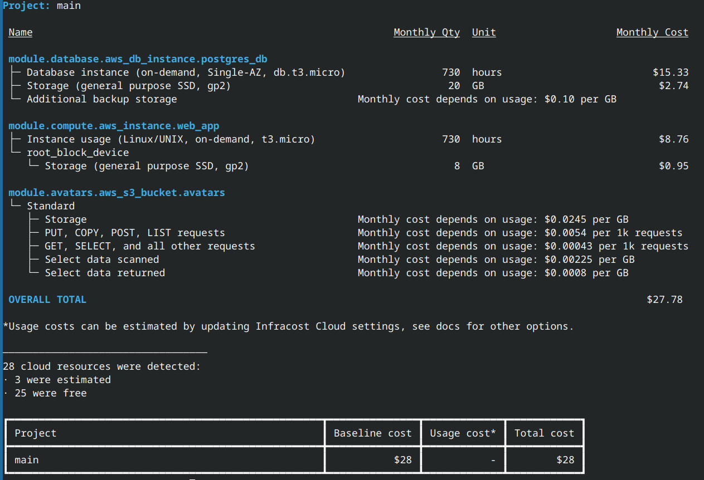

# Deployment Guide for AWS Grocery App


## 📖 Table of Contents

1. [Introduction](#introduction)  
2. [Infrastructure Overview](#infrastructure-overview)  
3. [Architecture Diagrams](#architecture-diagram)
4. [Folder strucuture](#folder-structure)
5. [Infrastucture components](#infrastucture-components)
6. [Infrastructure cost](#cost-estimate)
6. [Future enhancements](#future-enhancements)


# Introduction

This project is part of the **Cloud Track** in our Software Engineering bootcamp at Masterschool. 
The application was originally developed by **Alejandro Román**, our Track Mentor (huge thanks to him!). 
Our task was to design and deploy its **AWS infrastructure step by step**, implementing each component individually.  

I used terraform and github action to containerise application and deploy it. There are a couple of manual steps, which will soon be replaced with terraform code.

For details about the **grocery stores application's features, functionality, and local installation**, refer to the original [`App.md`](App.md) by Alejandro.  

This document focuses exclusively on the **AWS infrastructure, deployment process, and automation**.

---
## Infrastructure Overview

This modularized Terraform configuration provisions the infrastructure for a grocery web application using AWS.

The setup includes:
- An EC2 environment running Dockerized applications.
- A secure PostgreSQL database on RDS with Failover Replica in private subnets.
- An S3 buckets for storing user avatars and database dumps and terraform states.
- SSP Parameter store is used to store db credentials and other information that need to be shared between different infrastructure components.

## Architecture Diagrams


## Folder structure

1. Front end -  Grocery store application front end,refer to the original [`App.md`](App.md) by Alejandro.  . 
2. Backend - Grocery store application back end, refer to the original [`App.md`](App.md) by Alejandro.  . 
3. Infrastructure - Contains terraform for creating AWS infrastructure for running application.

## Infrastucture Components

1. VPC - Virtual Private Cloud - it hosts the application with other compnents.
2. ECR - Elastic Container Registry - it store the application docker image build using github action.
3. S3 Buckets -  there are 2 S3 buckets create, one for storing terraform states and another for storing avatar images.
4. AZs and subnets - there are 3 avaiblibilty zone each with separate subnet, 
    - public subnet to hosts application, connected to internet gateway 
    - private subnet to hosts RDS 
    - private subnet to hosts read replica of the RDS.
5. Security groups - 2 security groups
    - EC2 security group allows SSH from a specific IP and ALB traffic over port 5000.
    - RDS security group allows access only from EC2 instances.
6. Internet Gateway - it allow application EC2 instace to exposer application over internet.
7. SSM Parameter store - it stores data that is shared between EC2 instance and RDS, including database credentials.

## Deployment steps

1. Create `variables.tfvars` file with following details in infrastructure folder
```terraform
db_username    = "<db_username>"
db_password    = "<strong db_password>"

```
2. Provision infrastructure using terraform commands.
```sh
terraform plan -var-file=variables.tfvars
terraform apply -var-file=variables.tfvars
```
3. Login into EC2 instance
4. Pull the image from ECR
```sh
AWS_REGION=eu-central-1
AWS_ACCOUNT_ID=$(aws sts get-caller-identity --query Account --output text)
ECR_URI=${AWS_ACCOUNT_ID}.dkr.ecr.${AWS_REGION}.amazonaws.com/masterschool

# Authenticate Docker to ECR
aws ecr get-login-password --region $AWS_REGION \
  | docker login --username AWS --password-stdin \
      ${AWS_ACCOUNT_ID}.dkr.ecr.${AWS_REGION}.amazonaws.com

# Pull the image
docker pull ${ECR_URI}:latest
```

5. Create `grocerymate.env` file with following details
```env
JWT_SECRET_KEY=<enerate with: python3 -c "import secrets; print(secrets.token_hex(32))">
POSTGRES_USER=<username>
POSTGRES_PASSWORD="<strong password>"
POSTGRES_DB=grocerymate_db
POSTGRES_HOST=<rds endpoing>
POSTGRES_URI=postgresql://${POSTGRES_USER}:${POSTGRES_PASSWORD}@${POSTGRES_HOST}:5432/${POSTGRES_DB}
S3_BUCKET_NAME=saf-grocery-store-v3
S3_REGION=eu-central-1
USE_S3_STORAGE=true
```
6. Run docker container using following command
```sh
docker run -d \
  --name grocerymate \
  --restart unless-stopped \
  --env-file ~/grocerymate.env \
  -p 5000:5000 \
  ${ECR_URI}:latest
```
7. Verify application is running correctly

## Cost estimate

As on 20 March 2026, cost estimate of infrastructure defined in code base is generate by [Infracost](https://www.infracost.io/) tool is as follwoing.


## Future enhancements

1. Add auto scaling and load balancer.
2. Use Fargate instead of EC2 instace to run application.
3. Configure alert to send notification in case of unexpected event.
