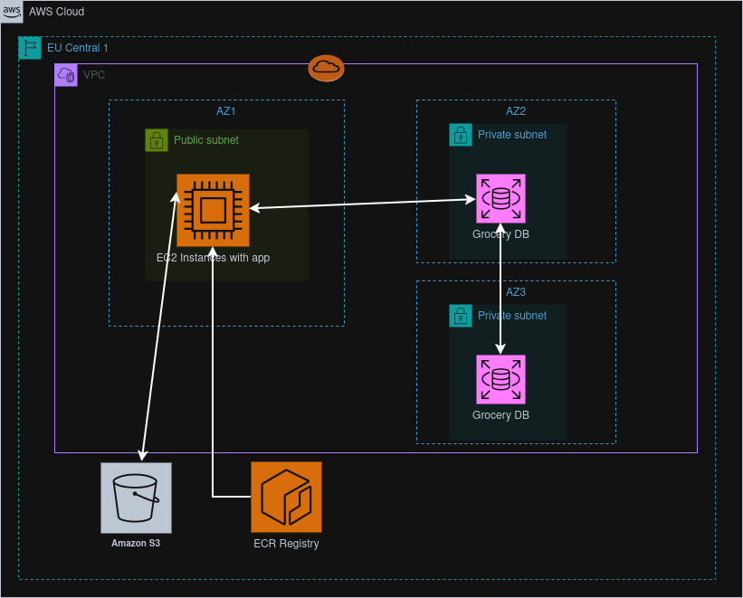

# Deployment Guide for AWS Grocery App

## 📖 Table of Contents

1. [Introduction](#-introduction)  
2. [Infrastructure Overview](#-infrastructure-overview)  
3. [Architecture Diagrams](#-Architecture-Diagrams)

## Introduction

This project is part of the **Cloud Track** in our Software Engineering bootcamp at Masterschool. 
The application was originally developed by **Alejandro Román**, our Track Mentor (huge thanks to him!). 
Our task was to design and deploy its **AWS infrastructure step by step**, implementing each component individually.  

Instead of a manual setup, I took the challenge further by **fully automating the provisioning and deployment** using 
**Terraform and GitHub Actions**. This ensures a **scalable, repeatable, and error-resistant deployment process**, 
eliminating the need for manual configurations.  

For details about the **application's features, functionality, and local installation**, refer to the original [`README.md`](APPLICATION.md) by Alejandro.  

This document focuses exclusively on the **AWS infrastructure, deployment process, and automation**.

---
## Infrastructure Overview

This modularized Terraform configuration provisions the infrastructure for a grocery web application using AWS.
The setup includes:
- An EC2 environment running Dockerized applications.
- A secure PostgreSQL database on RDS with Failover Replica in private subnets.
- An S3 bucket for storing user avatars and database dumps.

## Architecture Diagrams

